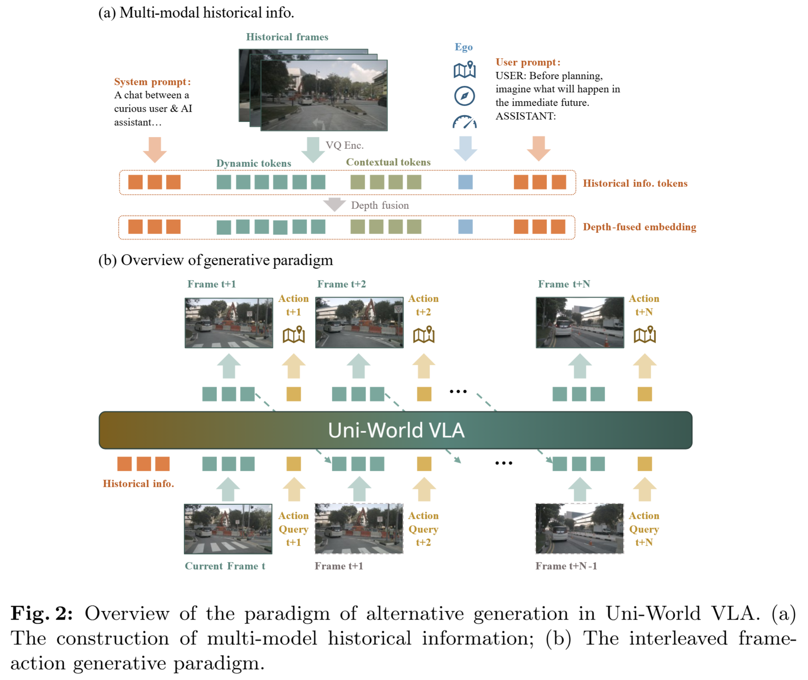
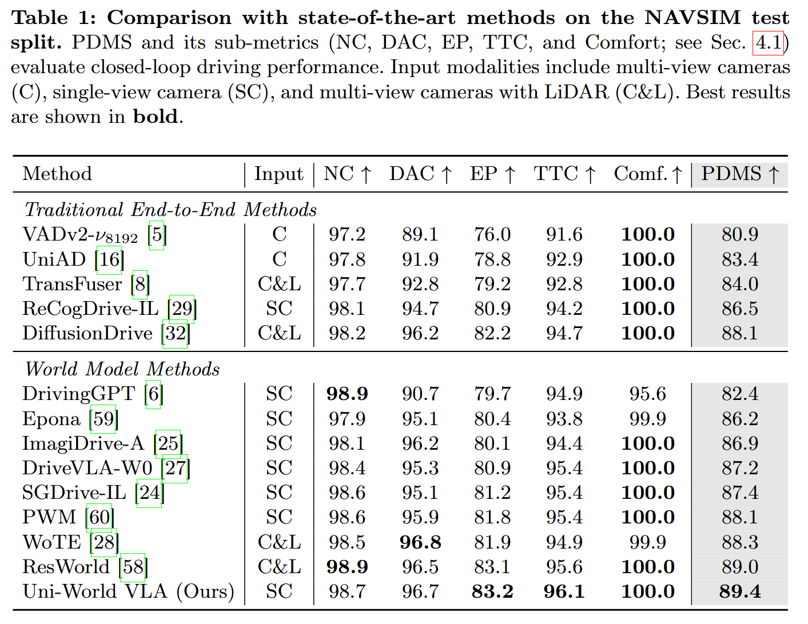
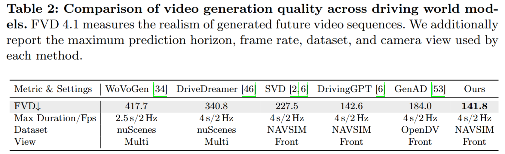
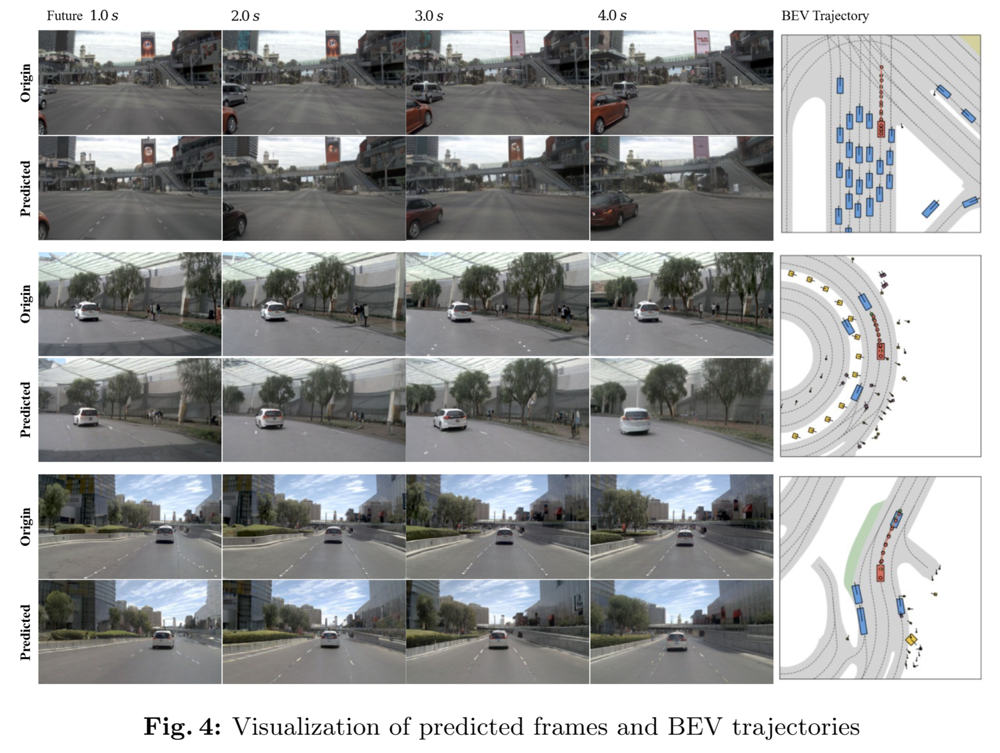

<div align="center">

# **Uni-World VLA**: Interleaved World Modeling and Planning for Autonomous Driving

**Qiqi Liu<sup>1,2,3</sup>\*, Huan Xu<sup>3</sup>\*, Jingyu Li<sup>1,2,3</sup>, Bin Sun<sup>3</sup>†, Zhihui Hao<sup>3</sup>†, Dangen She<sup>3</sup>, Xiatian Zhu<sup>4</sup>, Li Zhang<sup>1,2</sup>‡**

<sup>1</sup>Fudan University; <sup>2</sup>Shanghai Innovation Institute; <sup>3</sup>Li Auto Inc.; <sup>4</sup>University of Surrey  
<span style="color: #aaaaaa;">\* equal contribution; † project leader; ‡ corresponding author</span>

[](https://arxiv.org/abs/2603.27287)

</div>

---

## 📰 News

---

## 🔭 Project Overview



---

## 💡 Key Features

- **🔄 Interleaved world modeling and planning:** alternates future frame prediction and ego action/trajectory generation step-by-step, forming a closed-loop interaction that keeps planning conditioned on imagined observations.
- **🤖 Unified autoregressive VLA formulation:** generates visual tokens and action queries in a single sequence, tightly coupling prediction and control under temporal causality.
- **📹 Depth integration for geometric cues:** augments historical frames with monocular depth maps and fuses geometry features via cross-attention to improve long-horizon scene prediction.

---

## 📊 Results

**Table 1.** Closed-loop planning results on NAVSIM.



**Table 2.** World modeling / prediction results on NAVSIM.



**Visualization.**



---

## 🧾 TODO

- [x] Release arXiv paper 
- [ ] Release code
- [ ] Release model weights

---

## 📖 Citation

```bibtex
@article{liu2026uniworld,
  title   = {Uni-World VLA: Interleaved World Modeling and Planning for Autonomous Driving},
  author  = {Liu, Qiqi and Xu, Huan and Li, Jingyu and Sun, Bin and Hao, Zhihui and She, Dangen and Zhu, Xiatian and Zhang, Li},
  journal = {arXiv preprint arXiv:2603.27287},
  year    = {2026},
}
```
